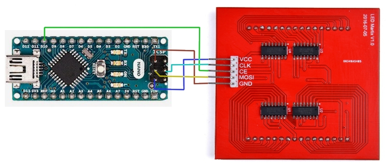
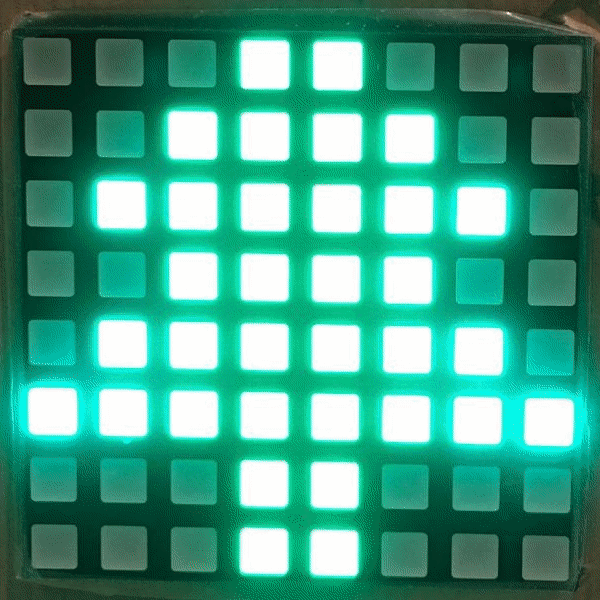
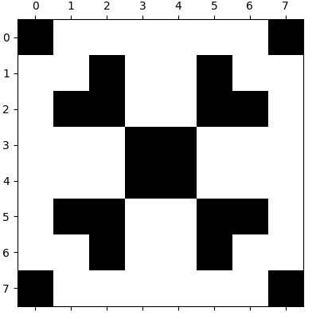

# Merry christmas from arduino

This project shows christmas images on a 8x8 rgb led matrix grid

## setup

For this project you'll need :

- an arduino nano
- a matrix RGB grid [see](https://wiki.52pi.com/index.php/RPI-RGB-LED-Matrix_SKU:EP-0075)

## arduino plug

To put it your arduino first plug your arduino as follows :



## arduino code

run the following

```
arduino christmas.ino
```

## result



## see patern examples

install deps :

```
pip install -r requierements.txt
```

run the script for one drawing (here snow4.txt)

```
python draw.py snow4.txt
```




show all .txt drawing

```
python draw.py
```

## Generate new paterns

You can add new paterns and visualise it with python

1. create `my_object.txt` file in the repo folder
2. fill it with 1 and 0 with 8 lines of 8 bits (don't forget to add an empty line at the end)
3. show the result with `python draw my_object.txt`

The console log with show the hex values to be used in the christmas.ino

ex:
```
{0x81,0x24,0x66,0x18,0x18,0x66,0x24,0x81}
```